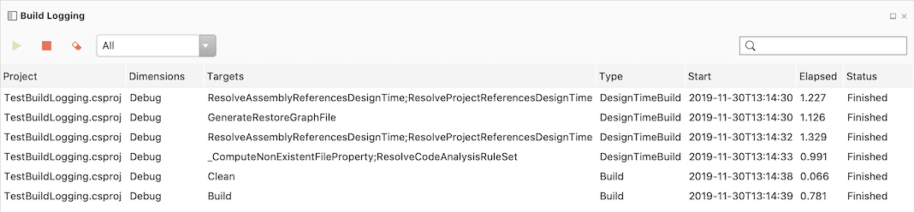
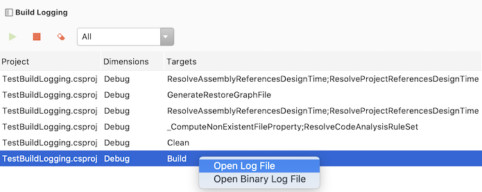
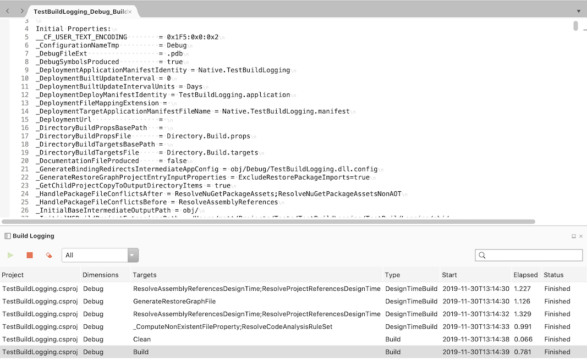
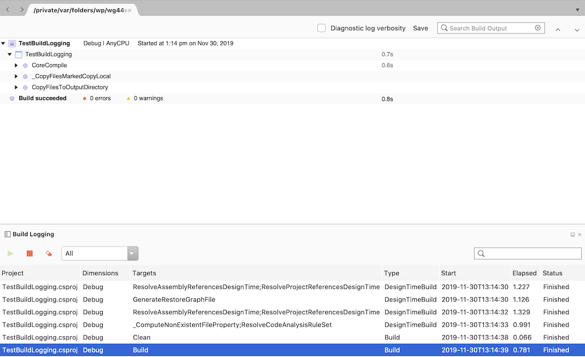

# Project System Tools for MonoDevelop and Visual Studio for Mac

Inspired by [Project System Tools for Visual Studio on Windows](https://github.com/dotnet/project-system-tools).

## Build Logging Window

To open the Build Logging Window

  - Select View - Pads - Build Logging

Click the green arrow button to enable the logging of the MSBuild targets for builds and design-time builds.

To stop the logging click the red square stop button.

To filter the targets either use the combo box to restrict the targets to builds or design time builds, or use the search, on the right hand side of the window, to filter the targets displayed.

To open the log output for an MSBuild target

  - Double click the row.
  - Right click the row and select Open Log File

To open a binary log into the binary log viewer:

  - Right click the row and Open Binary Log File

Note that not all MSBuild targets currently support generating a binary log.

